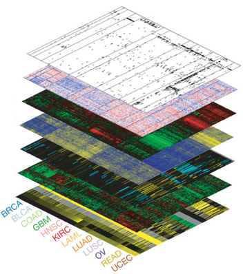

Our lab's research interests is to integrate biology understanding, genome sequencing, statistical modeling and machine learning to illuminate the genetic or genomic basis of phenotypic variation and to enhance plant improvement.
Our lab's major research interests include:
1. *A* Advanced biological knowledge
2. *G* Quantitative Genetics. GWAS and Genomic Selection.
We identify **trait associated variants (TAVs)** using **QTL mapping**, **Genome-wide Association Study (GWAS)**, **selection scanning**, and **XP-GWAS**; 
3. *C* Coding Genomics codes. RNA-seq, DMR, methylation.
4. *T* IT Technology. using HPC, Distributed computation, and machine learning Technologies.

(2) the characterization and engineering of genome-editing proteins towards next-generation human therapeutics;
and (3) the laboratory evolution and delivery in vivo of proteins that modify information flow in human cells.

-----------------------

## Quantitative Genetics

This is some text. This is some text.
This is some text. This is some text.
This is some text. This is some text.
This is some text. This is some text.
This is some text. This is some text.
This is some text. This is some text.
This is some text. This is some text.
This is some text. This is some text.
This is some text. This is some text.
This is some text. This is some text.
This is some text. This is some text.
This is some text. This is some text.
This is some text. This is some text.
This is some text. This is some text.
This is some text. This is some text.
This is some text. This is some text.

-----------------------

## Statistical Genomics

This is some text. This is some text.
This is some text. This is some text.
This is some text. This is some text.
This is some text. This is some text.
This is some text. This is some text.
This is some text. This is some text.
This is some text. This is some text.
This is some text. This is some text.
This is some text. This is some text.
This is some text. This is some text.
This is some text. This is some text.
This is some text. This is some text.
This is some text. This is some text.
This is some text. This is some text.
This is some text. This is some text.
This is some text. This is some text.

------------------

## Phenotyping
This is another text.

Something else.
